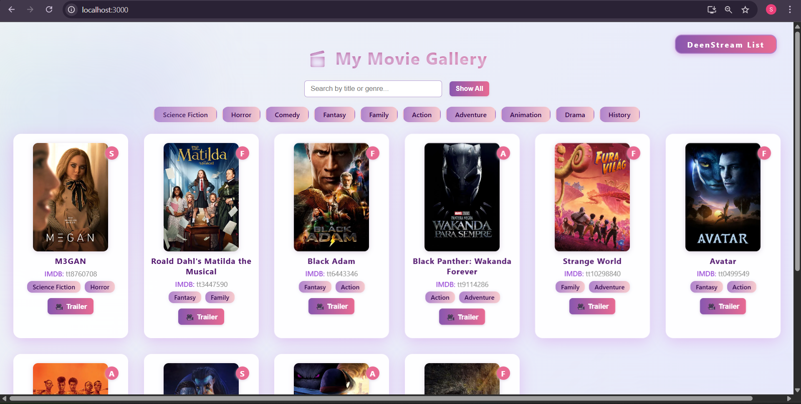

# 🎬 DeenStream Movie Gallery

Welcome to DeenStream Movie Gallery – a visually stunning, interactive web app to organize, browse, and discover your favorite movies!

---

## 🚀 What makes this app special?

- 🔎 **Instant Search** - Find movies quickly with live keyword and genre filtering.
- 🍿 **Modern Styling** - Experience glassy backgrounds, animated movie cards, and a stylish badge.
- 🎞️ **Trailers & Details** - Click through to watch trailers or read IMDB info for every movie.
- 📱 **Mobile Friendly** - Responsive design looks great on both desktop and mobile devices.

---

## 🛠️ How was it built?

1. **Designed a system architecture** using React for the frontend, Spring Boot for the backend, and MongoDB for the database.
2. **Developed an interactive UI** with genre badges, search features, poster images, and modern visual effects.
3. **Created a REST API backend** to store and serve the movie data.
4. **Connected everything** for seamless data flows and an awesome movie-browsing experience.
5. **Version controlled with Git** and published right here for you to explore!

---

## 🏁 Want to run it yourself?

### 1. Install Prerequisites

- Node.js and npm (for frontend)
- Java 17+ (for backend/Spring Boot)
- MongoDB (for database)

### 2. Clone or Download This Project

- Use Git:
git clone https://github.com/Deenprasath/deen-movie-gallery.git

OR  
- Click the green "Code" button and "Download ZIP"

### 3. Set up MongoDB

- Start MongoDB server (default port: 27017)
- Optionally import sample data:
mongoimport --db moviedb --collection movies --file movies-1.json --jsonArray

### 4. Run the Backend (Spring Boot)

- Open terminal and navigate to backend folder (like `movies`)
cd fullstackproject/movies

- Run:
./mvnw spring-boot:run

*or*
mvn spring-boot:run

- Backend runs on `http://localhost:8080`

### 5. Run the Frontend (React)

- Open terminal and navigate to frontend folder (like `movieist-frontend`)
cd fullstackproject/movieist-frontend

- Install dependencies:
npm install

- Start the React app:
npm start

- Frontend starts at `http://localhost:3000`

### 6. Open the App in Browser

- Go to `http://localhost:3000` to use the Movie Gallery

---
---
## 📸 Project Screenshot

## 🤝 Contributing

Suggestions, bugs, or movie recommendations?  
Feel free to open an issue or send a pull request!

---

**Developed with 💜 by Deen Prasath**
